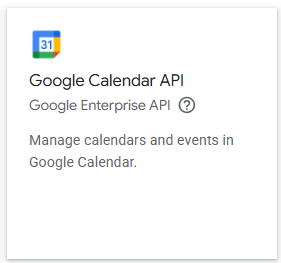

## README

A continuación se presenta el readme de una aplicación desarrollada en la biblioteca de javascript React, Vite, html y javascript.
Es una aplicación que se conecta con la api de google calendar. Se crea un calendario y este se integra a la aplicación, para que cuando se creen eventos, estos se desplieguen en el calendario.
Para el despliegue se utilizara el servicio de terceros Netlify, puesto que se comunica bien con Vite.

## Descripción

# a)Instalación del proyecto

Para que el proyecto funcione a nivel local , fue necesario instalar vite con su estructura de carpetas, con un template de react:

```bash
npm create vite@latest PROYECTO react
```

Posteriormente se ingresó a la carpeta creada por medio de la terminal, y se ejecutó el siguiente comando para instalar las dependencias de node.js , por ejemplo la carpeta node_modules.
```bash
npm install
```
A continuación, con este comando se hizo correr el proyecto y verlo en el navegador.
```bash
npm run dev
```
Guardar la ruta http:localhost:5173. Esta dirección guardarla por que sirve para configurar la api de google calendar.
Posteriormente es necesario instalar una libreria externa para el manejo de rutas llamado react router DOM.
Nota:Router significa manejador de rutas.
```bash
npm install react-router-dom
```
Posteriormente se instalo la libreria de estilos MaterialUI(web:www.miu.com), para crear una barra de navegación responsive.
```bash
 npm install @mui/material @emotion/react @emotion/styled
```
Una vez este listo, se instalo los iconos de esta libreria de estilos de Material UI.
```bash
 npm install @mui/icons-material
```

# b) Instalacion de librerias importantes para usar la api de google calendar:

gapi-script : Entrega un wrapper para usar la api en aplicaciones de react
google-auth-library:Maneja la autenticacion de google
google apis:Biblioteca oficial de google para interactuar con sus apis
Comando para instalar librerias de google:

```bash
npm install gapi-script@^1.2.0 google-auth-library@^9.15.1 googleapis@^148.0.0
```
Para el despliegue de los eventos en formato calendario, se requiere una biblioteca de calendario denominada "react-big-calendar". El comando de instalacion es el siguiente:

```bash
npm install react-big-calendar moment moment-timezone
```
# b) Configuración de API de google calendar y creación de calendario :

Para configurar la API, se ingresó a la página https://console.cloud.google.com/ , se creó una cuenta, y un proyecto de prueba.
Posteriormente se ingresó a APIs y servicios- > APIs y servicios habilitados - > Habilitar APIs y servicios y finalmente buscar Google Calendar API(Ver la siguiente imagen). Ingresar a esta api y por último realizar clic en habilitar esta API.


